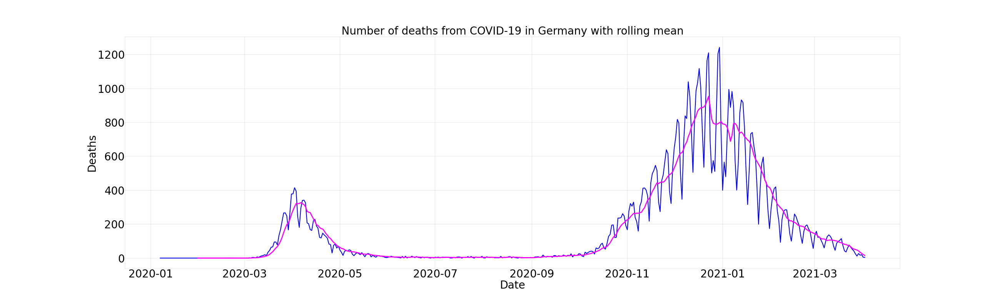

# Covid-19: Prediction of deaths in Germany

In this notebook I predict the number of deaths in Germany, using the data of existing deaths acquired [here](https://www.kaggle.com/headsortails/covid19-tracking-germany).

The user can choose the starting date for the review period.

For the task of forecasting I impement three statistical models:

* SARIMAX, 

* Exponential Smoothing and 

* AutoRegression

The best model proves to be the **SARIMAX** model, while the 7-days rolling average curve fits at best to the actual figures of deaths per day in Germany.

## Plots




## Scripts


You can either open the [Notebook](Death_prediction_covid-19_Germany.ipynb) or run the [script](Death_prediction_covid-19_Germany.py.py) as following:

```
python3 exploratory_analysis_covid-19.py
```

## Requirements:

All scripts were developed using Python 3.8.6 on Ubuntu 20.04.1 LTS.

They have been tested with the following package versions:

* numpy == 1.19.4

* matplotlib == 3.3.2

* pandas == 1.1.4

* statsmodels == 0.12.1

To install them run in a shell:

```
pip install -r requirements.txt
```
